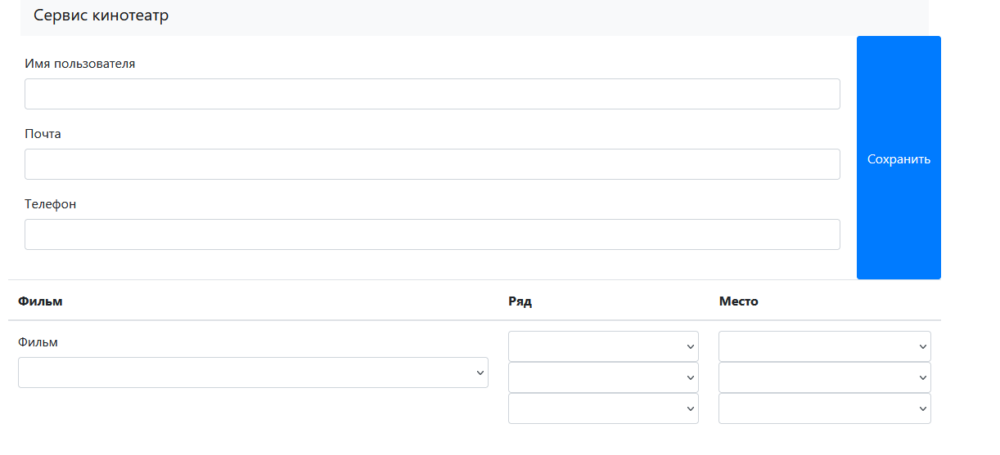
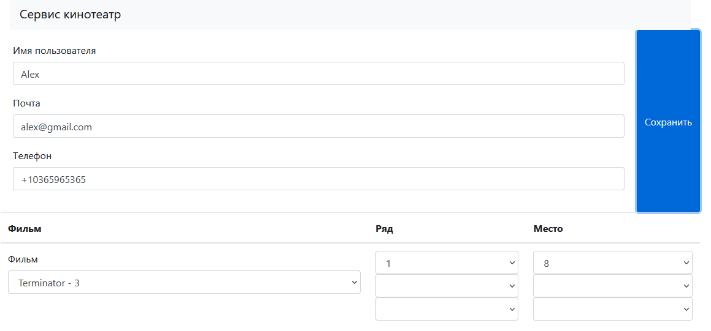
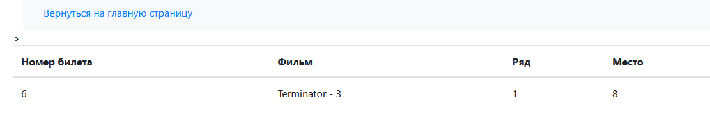

# Проект "Кинотеатр"

#### В этом проекте разработан сайт для покупки билетов в кинотеатр.
#### Требуемые элементы:
*     PostgreSql 14
*     JDK 18
*     Maven 3.8.1

#### Перед запуском проекта:
*     Cоздать БД cinema_db
*     поменять login/password в файле src/main/resources/application.properties


Запуск приложения:
```shell

mvn spring-boot:run


```


#### Стек технологий:
* Spring boot
* Thymeleaf
* Bootstrap
* JDBC

Главная страница форма с выбором фильма. Ряда и места.



После загрузки формы отображается результат покупки.


