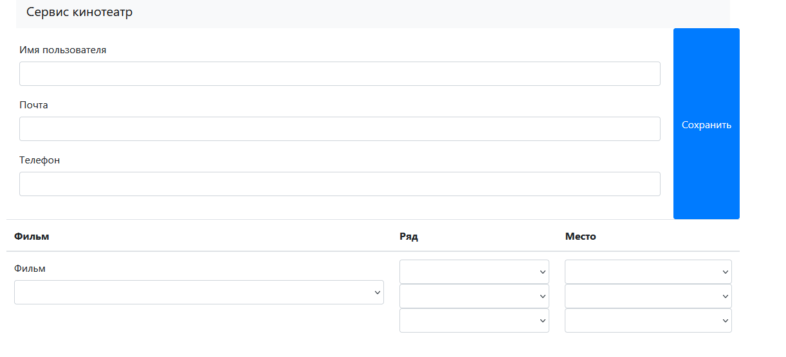
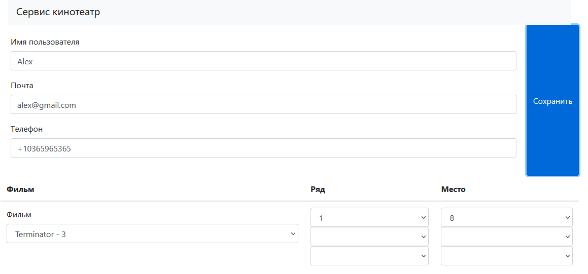
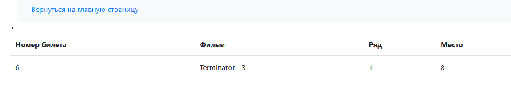

# Проект "Кинотеатр"

#### В этом проекте разработан сайт для покупки билетов в кинотеатр.
#### Требуемые элементы:
*     PostgreSql 14
*     JDK 17
*     Maven 3.8.1

#### Перед запуском проекта:
*     создать базу данных через скрипты ./db/scripts/
*     поменять login/password в файле src/main/resources/application.properties

Запуск приложения:
*     выполнить команду maven install
*     выполнить команду java -jar target/job4j_cinema-1.0.jar
*     после запуска сервера перейти на адрес: http://localhost:8080/index

#### Стек технологий:
* Spring boot
* Thymeleaf
* Bootstrap
* JDBC

Главная страница форма с выбором фильма. Ряда и места.

После загрузки формы отображается результат покупки.

